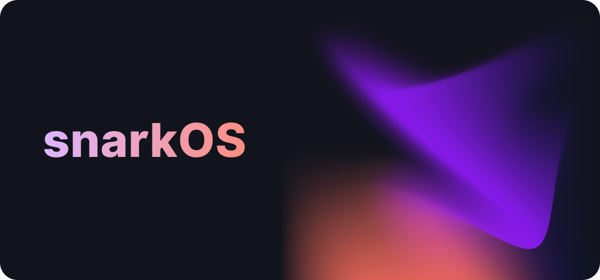

<p align="center">
    
</p>

<h1 align="center">snarkOS</h1>

<p align="center">
    <a href="https://circleci.com/gh/AleoHQ/snarkOS"></a>
    <a href="https://codecov.io/gh/AleoHQ/snarkOS"></a>
    <a href="https://discord.gg/6WG7Bck"></a>
</p>

## <a name='TableofContents'></a>Table of Contents

* [1. Overview](#1-overview)
* [2. Quick Start](#2-quick-start)
    * [Option 1 - Download snarkOS](#option-1---download-snarkos)
    * [Option 2 - Install from Crates.io](#option-2---install-from-cratesio)
    * [Option 3 - Build from Source Code](#option-3---build-from-source-code)
* [3. Usage Guide](#3-usage-guide)
    * [3.1 Connecting to the Aleo Network](#31-connecting-to-the-aleo-network)
    * [3.2 Command Line Interface](#32-command-line-interface)
    * [3.3 Configuration File](#33-configuration-file)
* [4. JSON-RPC Interface](#4-json-rpc-interface)
* [5. Additional Information](#5-additional-information)
* [6. License](#6-license)

## 1. Overview

__snarkOS__ is a decentralized operating system for private applications. It forms the backbone of [Aleo](https://aleo.org/) and 
enables applications to verify and store state in a publicly verifiable manner.

## 2. Quick Start

### Option 1 - Download snarkOS

#### Step 1. Download the executable

| [![[]][mac_logo]][mac_dl]    | [![[]][linux_logo]][linux_dl]   | ![[]][windows_logo]   |
|:----------------------------:|:-------------------------------:|:---------------------:|
| [![[]][mac_badge]][mac_dl]   | [![[]][linux_badge]][linux_dl]  | ![[]][windows_badge]  |

[mac_logo]: https://raw.githubusercontent.com/wiki/ryanoasis/nerd-fonts/screenshots/v1.0.x/mac-pass-sm.png
[mac_badge]: https://img.shields.io/badge/download-testnet1_for_mac-blue?url=https%3A%2F%2Fapi.github.com%2Frepos%2Faleohq%2Fsnarkos%2Freleases%2Flatest&query=%24.assets[0].name&style=for-the-badge
[mac_dl]: https://github.com/AleoHQ/snarkOS/releases/download/v1.1.4/aleo-testnet1-v1.1.4-x86_64-apple-darwin.zip

[linux_logo]: https://raw.githubusercontent.com/wiki/ryanoasis/nerd-fonts/screenshots/v1.0.x/linux-pass-sm.png
[linux_badge]: https://img.shields.io/badge/download-testnet1_for_linux-blue?url=https%3A%2F%2Fapi.github.com%2Frepos%2Faleohq%2Fsnarkos%2Freleases%2Flatest&query=%24.assets[1].name&style=for-the-badge
[linux_dl]: https://github.com/AleoHQ/snarkOS/releases/download/v1.1.4/aleo-testnet1-v1.1.4-x86_64-unknown-linux-gnu.zip

[windows_logo]: https://raw.githubusercontent.com/wiki/ryanoasis/nerd-fonts/screenshots/v1.0.x/windows-pass-sm.png
[windows_badge]: https://img.shields.io/badge/download-coming_soon-orange?style=for-the-badge

#### Step 2. Install the executable

##### macOS or Linux

Unzip the package and in terminal, `cd` into the unzipped folder and run:
```
mv snarkos /usr/local/bin
```

##### Windows

```
Coming Soon
```

#### Step 3. Start snarkOS

To start a snarkOS client node, run:
```bash
snarkos
```

### Option 2 - Install from Crates.io

#### Step 1. Install Rust

We recommend installing Rust using [rustup](https://www.rustup.rs/). You can install `rustup` as follows:

##### macOS or Linux
```bash
curl --proto '=https' --tlsv1.2 -sSf https://sh.rustup.rs | sh
```

##### Windows
  
Download the [Windows 64-bit executable](https://win.rustup.rs/x86_64) or [Windows 32-bit executable](https://win.rustup.rs/i686)
and follow the on-screen instructions.

#### Step 2. Install from Crates.io

In your terminal, run:

```bash
cargo install snarkos
```

#### Step 3. Start snarkOS

To start a snarkOS client node, run:
```bash
snarkos
```

### Option 3 - Build from Source Code

#### Step 1. Install Rust

We recommend installing Rust using [rustup](https://www.rustup.rs/). You can install `rustup` as follows:

##### macOS or Linux
```bash
curl --proto '=https' --tlsv1.2 -sSf https://sh.rustup.rs | sh
```

##### Windows
  
Download the [Windows 64-bit executable](https://win.rustup.rs/x86_64) or [Windows 32-bit executable](https://win.rustup.rs/i686)
and follow the on-screen instructions.

#### Step 2. Build from Source Code

Start by cloning this repository:
```bash
git clone https://github.com/AleoHQ/snarkOS --depth 1
```

Next, compile and install snarkOS:
```bash
cd snarkOS && cargo install --path .
```

#### Step 3. Start snarkOS

To start a snarkOS client node, run:
```bash
snarkos
```

<!--
### 2.2c Build with Docker

#### Docker build
```bash
docker build -t snarkos:latest .
``` 
or 
```bash
docker-compose build
```

#### Docker run
``` bash
docker run -d -p 4131:4131 --name snarkos snarkos 
```
or
```bash
docker-compose up
```
-->

## 3. Usage Guide

### 3.1 Connecting to Aleo Testnet I

To start a client node, run:
```
snarkos
```

To start a mining node, run:
```
snarkos --is-miner
```

To run a node with custom settings, refer to the full list of options and flags available 
in the CLI.

### 3.2 Command Line Interface

Full list of CLI flags and options can be viewed with `snarkos --help`:

```
snarkOS 1.1.4
Run an Aleo node (include -h for more options)

USAGE:
    snarkos [FLAGS] [OPTIONS]

FLAGS:
    -h, --help           Prints help information
        --is-bootnode    Run the node as a bootnode (IP is hard coded in the protocol)
        --is-miner       Start mining blocks from this node
        --no-jsonrpc     Run the node without running the json rpc server

OPTIONS:
        --connect <ip>                           Specify one or more node ip addresses to connect to on startup
    -i, --ip <ip>                                Specify the ip of your node
        --max-peers <max-peers>                  Specify the maximum number of peers the node can connect to
        --mempool-interval <mempool-interval>    Specify the frequency in seconds the node should fetch a sync node's mempool
        --min-peers <min-peers>                  Specify the minimum number of peers the node should connect to
        --miner-address <miner-address>          Specify the address that will receive miner rewards
        --network <network-id>                   Specify the network id (default = 1) of the node
    -d, --path <path>                            Specify the node's storage path
    -p, --port <port>                            Specify the port the node is run on
        --rpc-password <rpc-password>            Specify a password for rpc authentication
        --rpc-port <rpc-port>                    Specify the port the json rpc server is run on
        --rpc-username <rpc-username>            Specify a username for rpc authentication
        --verbose <verbose>                      Specify the verbosity (default = 1) of the node [possible values: 0, 1, 2]
```

#### Examples

##### Guard RPC endpoints
```
snarkos --rpc-username <Username> --rpc-password <Password>
```

##### Manually connect to a peer on the network
```
snarkos --connect "<IP ADDRESS>"
```

### 3.3 Configuration File

A `config.toml` file is generated in the `~/.snarkOS/` directory when the node is initialized for the time. 
Updating this `config.toml` file allows node operators to specify default settings for the node without 
having to specify additional information in the CLI.

## 4. JSON-RPC Interface

By default, snarkOS 1.1.4 a JSON-RPC server to allow external interfacing with the Aleo network. Documentation of the RPC endpoints can be found [here](rpc/README.md)

## 5. Additional Information

For additional information, please refer to the official [Aleo documentation page](https://developer.aleo.org/aleo/getting_started/overview/).

## 6. License

[](./LICENSE.md)
