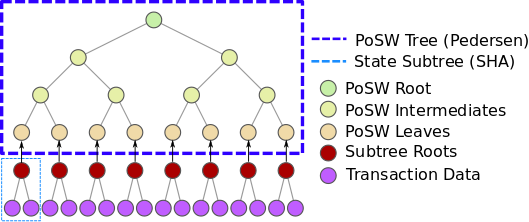

# The PoSW Predicate

The predicate used as part of the PoSW circuit verifies the inclusion of transactions in a given block. The various building blocks are defined below alongside the relevant implementation parameters.

## System State

The state of the system is given by a Merkle tree  of depth  over a CRT function , where  is taken to be SHA-256 with k = 512. We denote this as the "state tree". Each leaf is the unique id of a transaction to be processed, and the variable  is the root of the tree.

</img>

The PoSW circuit takes the  subtree of the state tree and computes a Merkle tree of depth . The leaves of the tree are the depth  elements of the state tree , instantiated over k-bit leaves with a different CRT function  as a new PoSW tree . This layout is illustrated in the diagram on the left. 

The circuit implementation for  masks the witness variables based on a pseudorandom seed, which is part of the predicate statement. This is required to achieve non-amortization guarantees. We set  throughout.

## Pedersen Primitives
The -bit Pedersen hash function over  is a CRT hash given by: 
 where  are randomly sampled generators and  the -th input bit of . CRT security of this function reduces to the hardness of the Discrete Logarithm Problem (DLP) over the group 

The above function can be evaluated in a 'masked' fashion, using the primitives below.

### Symmetric Pedersen Gadget

The -bit symmetric Pedersen hash is defined with the same security guarantees as  where: 

 

#### Circuit Structure

Define group variables . Check the following evaluations:
- If   set , else if  set to .
-  is the identity and .

This requires  Edwards multiplications (6 constraints each), and a bit lookup for each of the  in addition to  booleanity checks.

This is evaluated by ``precomputed_base_symmetric_multiscalar_mul`` in ``PedersenCRHGadget``.
  

### Masked Pedersen Gadget
The -length masked Pedersen hash function over  is a CRT hash function  given by:

Where  and  the -th bits of  and  respectively, while  are randomly sampled generators of  and  the bitwise XOR operation. The variable  is appended as an input as well, for the demasking operation.

#### Circuit Structure
Define group variables  and boolean variables . Perform the following evaluations:
- With a 2-bit lookup, for all  set 
 	-  if  and 
 	 -  if  and 
 	-  if  and 
 	-  if  and 
-  and .

This requires  Edwards multiplications (6 constraints each), a 2-bit lookup for each of the  (2 constraints each) and  booleanity checks.

This is evaluated by ``precomputed_base_scalar_mul_masked`` in ``PedersenCRHGadget``.

### Pedersen Hash Gadget

We instantiate a circuit verifying  evaluations of  using circuits for  and  over . Note that elements are variables in , while pairs of variables  are parsed as elliptic curve points in  We presume that the  have been precomputed and are accessible as constants.

#### Inputs:

The -length masked evaluation of  Pedersen hashes takes as inputs:
- For , boolean variables . 
- A boolean seed .
#### Evaluations:
- Set .
-  For all ,  set .

#### Outputs:
The  length set of variables  as the truncated outputs.

### Instantiation
We use BLS12-377 as the underlying group, which implies an output length of 256+1 = 257 bits (using point-compression) which we truncate to 256 bits. Security reduction to the hardness of ECDLP yields a security level of  bits. The input length is set to k = 512 bits. 

## PoSW Circuit 

The PoSW tree $ takes in the subroots of the state tree's -depth nodes as leaves, and uses the -bit Pedersen hash gadget with respect to a seed parameter  to compute the root . The seed parameter  is the output of a pseudorandom function  with boolean inputs the nonce  and the tree root.

### Seed Generation
We generate the seed  in the following way for each predicate:

1. Given input nonce  and , compute  as , where  represents string concatenation.

2. If the -th bit  of  is 0 or 1, set the (2i-1)-th and 2i-th bits of  as 10 or 01 respectively. This gives a  of constant Hamming distance 256.

This is all done outside of the circuit, and is required input format for every valid instance.

### Circuit Size

#### Statement-Witness Definition
A valid statement , where: 

1.  the bitwise representation of the PoSW root node of the updated state variable.
2.  the bitwise representation of the nonce.

The witness  for the above statement consists of:

1. A boolean representation of .

2. The subroot leaves  corresponding to .

3. Boolean representations of the intermediate node values of .

#### Evaluations

For the root  and all internal nodes of , perform a computation of the  gadget with the node value as output and its children as inputs. 

The PoSW circuit verifies that  is correctly generated. This requires the computation of  instances of .

 
